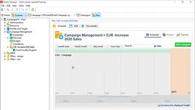
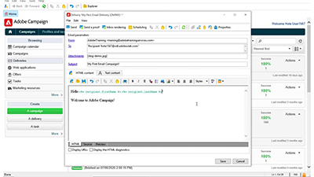
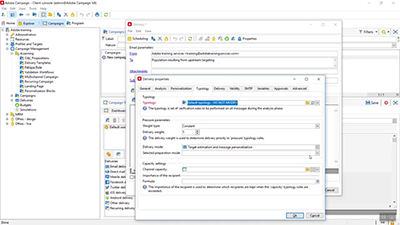
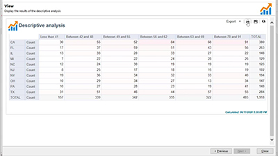

# Adobe Campaign v8 Client Console Tutorials

Adobe Campaign provides a platform for designing cross-channel customer experiences and provides an environment for visual campaign orchestration, real time interaction management, and cross-channel execution. This user guide contains videos and tutorials on the many features and capabilities of Adobe Campaign V8 Client Console.

See 

>[!INFO]
> Do you have questions? Would you like to share your experience or exchange thoughts with your peers? Or, do you have feedback on the learning content for the Adobe team? Join the conversation in the [Adobe Campaign learning community thread](https://experienceleaguecommunities.adobe.com:443/t5/adobe-campaign-classic/join-the-discussion-on-adobe-campaign-learning/td-p/419096)!
> 
> These tutorials are not what you are looking for? 
> See the [Adobe Campaign Web User Interface tutorials](https://experienceleague.adobe.com/docs/campaign-web-learn/tutorials/overview.html) for guidance on how to use the Campaign Web User Interface.

>[!NOTE]
> Campaign v8 is currently only available as a Managed Cloud Service, and cannot be deployed on an on-premise or hybrid environments. Automated migration from an existing Campaign Classic v7 environment is not yet available.
>
>See the [product documentation](https://experienceleague.adobe.com/docs/campaign/campaign-v8/new/v7-to-v8.html) for more information about the transition from Classic v7 to V8. 

 
## Staff picks

<table>
<tr>
  <td>
    
    

      <a href="/help/get-started/create-a-marketing-plan-programs-and-campaigns.md">
    <strong>Create a marketing plan</strong>
    </a>
    

    

    <em>Learn how to create a marketing plan, program, and campaign.</em>
    

  </td>
   <td>
    
    

      <a href="./content-creation/create-and-design-email-deliveries.md">
    <strong>Create and design email deliveries</strong>
    </a>
    

    

    <em>Understand the process of creating an email delivery and learn how to design and personalize email content.
</em>
    

  </td>
  <td>
    
    

      <a href="./send-messages/fatigue-management/typology-rules-for-fatigue-management.md">
    <strong>Manage fatigue using typology rules</strong>
    </a>
    

    

    <em>Learn how to implement fatigue management in Adobe Campaign by using typology rules. </em>
    

  </td>
</tr>
<tr>
</td>
  <td>
    
    

      <a href="./reporting/generate-a-descriptive-analysis-report.md">
    <strong>Generate a descriptive analysis report</strong>
    </a>
    

    

    <em>Learn how to generate a descriptive analysis report from a workflow.</em>
    

  </td>
  <td>
   
     

      <a href="./data-management/data-management-fundamentals.md">
    <strong>Fundamentals of data management with workflows</strong>
    </a>
    

    

    <em>Learn what targeting dimensions and working tables are, and how Adobe Campaign manages data across different data sources.</em>
    

  </td>
  <td>
   
     

      <a href="./data-management/api-staging-mechanism.md">
    <strong>API staging mechanism with FFDA</strong>
    </a>
    

    

    <em>Learn how the API staging mechanism with full FDA works.</em>
    

  </td>
</tr>
</table>

